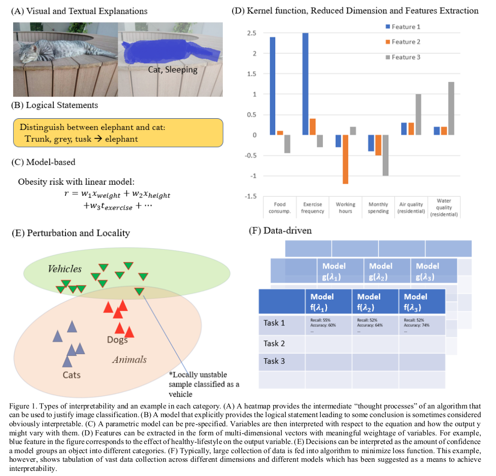

# Papers related to Explainable AI

Explainable AI (XAI) deals with explaining how an AI works. Here the AI is ML.

## 2018

### [Evolutionary Fuzzy Systems for Explainable Artificial Intelligence: Why, When, What for, and Where to?](https://ieeexplore.ieee.org/abstract/document/8610271)

This is a propositional paper, mostly dealing with the role of Fuzzy Rule Based Systems (FRBS) in XAI. A FRBS is per se not explainable, but they refer that using multi-objective evolutionary techniques, the system can optimized for interpretability. They define two views on interpretability:
* Understandability: We are able to understand how the algorithm works (makes its inference)
* Comprehensibility: We are able to understand the model.

FRBS is argued to be a good match for both. It has low accuracy today, but is among the most explainable, so focus should be to improve accuracy and maintaining the position ahead on interpretability.

### [A Survey on Explainable Artificial Intelligence (XAI): towards Medical XAI](); Erico Tjoa and Cuntai Guan

Surveys categories of XAI found in literature. Visual and textual explanations deals with providing the explanation through visual feedback to the end user, so to allow verifying if the presented result is acceptable. Logical statements deals with extracting rules from the system that lets the end user see how the system decides output. Model based is where the model of the system is directly interpretable, an example is a linear regression model. Kernel, reduced dimensions and feature extraction methods are where the reduction of features can give the end user insight into which features are important in accepting the decision. Locality and pertubation-based deals with observing the model, an example is LIME. Data driven interpretability seems to be a concept for model performance evaluation, it's not entirely clear, and no examples are given in relation to medical XAI. In relation to medical XAI: Visual approaches are useful, but there is a problem with dimensionality and size of the images in order to make useful visualisations. Kernel function can help to minimize this, but at additional interpretability cost. Model based mentions that it's used for "easy" problems. Finally some risks in medical XAI are mentioned:
* Jumping conclusion -- e.g. rules may make the end user jump to conclusions.
* Manipulation of explanations -- it has been shown that it's easy to manipulate explanations of DL models, at the same time hard for a human to observe the difference in input.
* Incomplete constraints -- the models do not consider some kinds of real-world constraints.
* Noisy training data -- we can have incorrect "ground truth" to deal with (garbage-in garbage-out problem)

